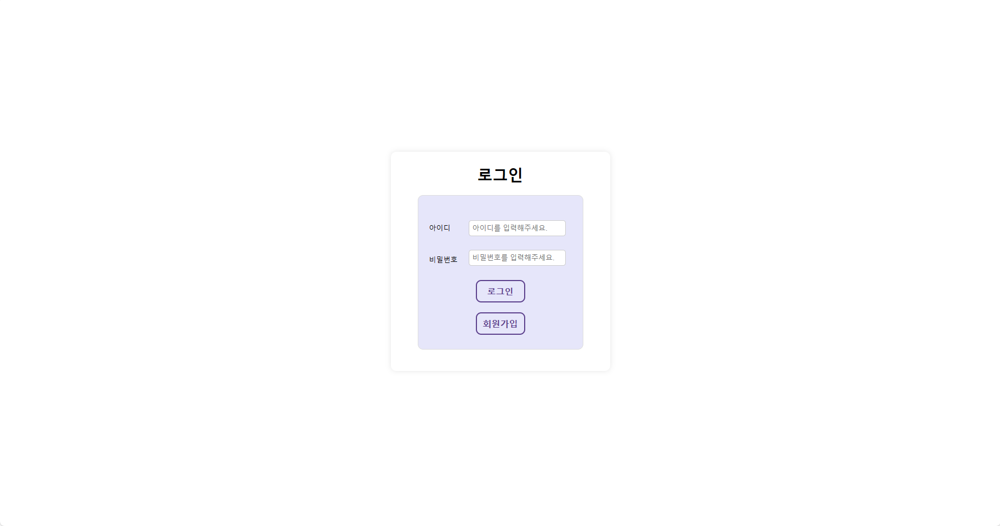

### README
# 가지마켓

   
  
   

## 프로젝트 소개

가지고 싶은 물건, 가지가지 다~있다! 가지마켓. 
중고상품 거래 및 소통을 위한 플랫폼으로서, 사용자들이 편리하고 간단하게 거래하고 소통할 수 있는 환경을 제공한다. 
다양한 상품 카테고리와 자유게시판을 통하여 사용자들이 다양한 상품을 구매하고 판매한다. 
사용자들 간의 소통을 촉진하여, 커뮤니티를 형성하고 함께 발전시켜 나가는 것 목표이다. 

 
 
 
 
 
 

 

## 기술 스택

| JavaScript |    Java    | 
| :--------: | :--------: | 
|   ![js]    |  ![java]   |

 

## 구현 기능

### 기능 1 : 메인

메인페이지

로그인 세션 정보를 받아와 메인페이지 상단에 표시한다.
판매글을 ROWNUM 을 사용하여 내림차순으로 정렬해 가장 최신 게시물 중 15개가 메인에 걸릴 수 있게 한다.
게시물의 사진이나 제목을 클릭하면 상세페이지로 넘어갈수있게 한다.

### 기능 2 : 검색

검색창

판매글의 제목을 검색어로 받아와 일치하는 게시글을 불러온다.
조회된 게시물의 사진이나 제목을 클릭하면 상세페이지로 넘어갈수있게 한다.

### 기능 3 : 회원가입

회원가입

사용자로부터 계정 ID, 비밀번호, 이름, 이메일, 전화번호를 받아 DB에 저장한다.
ID와 비밀번호, 이름 값은 필수값으로 받는다.
(조건 : ID는 영문, 숫자 5~20자 조합 / 비밀번호는 영문, 숫자, 특문 8~32자 조합 / 비밀번호확인 일치 / 무결성 제약조건을 catch로 걸어 중복된 ID 입력 시 가입 불가능)
가입 완료 시 로그인 창으로 이동하게 한다.

### 기능 4 : 로그인

로그인

사용자로부터 계정 ID, 비밀번호를 받아와 일치하는 경우 세션에 연결하고 메인페이지로 이동한다. (세션은 30분간 유지)

### 기능 5 : 회원정보변경

회원정보변경

사용자로부터 계정 ID, 비밀번호를 받아와 일치하는 경우 DB에서 비밀번호를 변경한다.

### 기능 6 : 탈퇴

회원탈퇴

사용자로부터 계정 ID, 비밀번호를 받아와 일치하는 경우 DB에서 회원데이터를 삭제한다.

 

## 배운 점 & 아쉬운 점

 
12/13 까지 해결해야 할 점
회원 탈퇴 후 자동 세션 아웃이 되지 않음.(수정완료) 
검색 후 검색버튼이 사라짐. 
회원 가입의 중복 된 아이디 확인 시 가입완료 안내메세지가 먼저 뜬 후 중복 알림이 뜸.(수정완료) 
로그인 시 일치하지 않는 아이디 & 비밀번호 메세지가 뜨지 않음. 
중복된 코드 재사용성으로 변경해서 코드 정렬 
MVC: DTO DAO 
트러블슈팅(trouble shooting) : 문제 해결의 일종 / 보통 컴퓨터 시스템에서 발생하는 문제들을 해결하는 용어로 많이 사용합니다. 

 

<!-- Stack Icon Refernces -->

[js]: ./readme-static/img/javascript.svg
[java]: ./readme-static/img/java.svg
